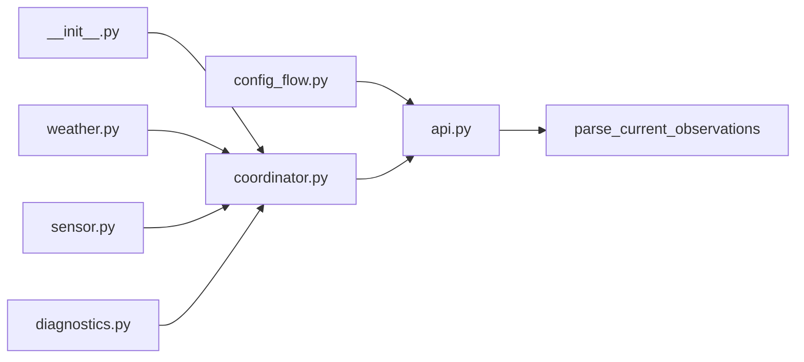

# Architecture

## Modules

- `api.py`: Async HTTP client and raw CHMI JSON parser.
- `models.py`: Normalized dataclasses.
- `config_flow.py`: UI setup, validation, and options.
- `coordinator.py`: Shared polling with `DataUpdateCoordinator`.
- `weather.py`: Standard Home Assistant `WeatherEntity`.
- `sensor.py`: Diagnostic `SensorEntity` values.
- `diagnostics.py`: Safe troubleshooting payload for config entries.

## Data flow

1. The config flow validates station input by fetching the current OpenData file.
2. The integration setup creates one API client and one coordinator per config
   entry.
3. Weather and sensor entities read normalized values from coordinator memory.
4. The coordinator keeps the last valid observation and converts fetch or parse
   errors into `UpdateFailed`.

## Forecast

Forecast is intentionally not exposed in the MVP. Future forecast work should
add explicit hourly/daily data sources and Home Assistant forecast methods
without legacy forecast attributes or fake values.
