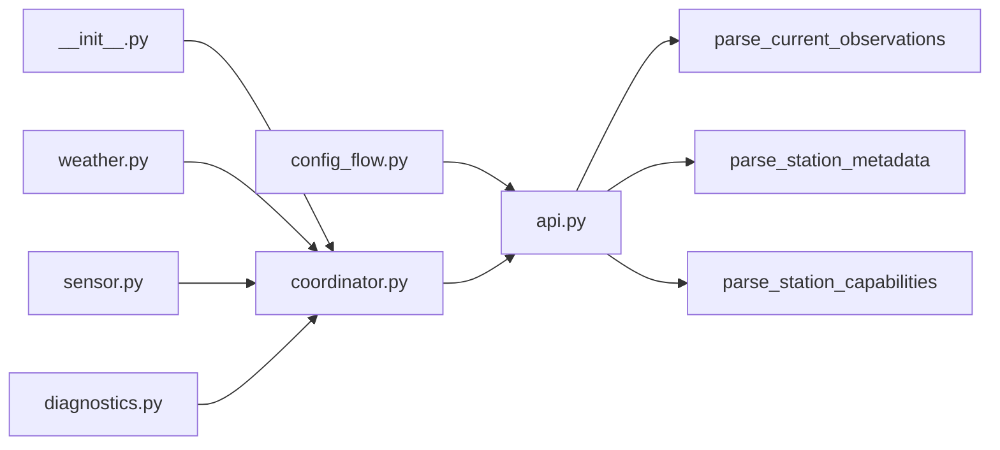

# Architecture

## Modules

- `api.py`: Async HTTP client and raw CHMI JSON parsers.
- `models.py`: Normalized dataclasses.
- `config_flow.py`: UI setup, validation, and options.
- `coordinator.py`: Shared polling with `DataUpdateCoordinator`.
- `weather.py`: Standard Home Assistant `WeatherEntity`.
- `sensor.py`: Diagnostic `SensorEntity` values.
- `diagnostics.py`: Safe troubleshooting payload for config entries.

## Data flow

1. The config flow uses Home Assistant GPS coordinates when configured, or asks
   for GPS coordinates without fallback defaults. It then fetches official CHMI
   station metadata and offers the nearest stations for selection.
2. After station selection, the config flow validates station capabilities and
   current OpenData observations.
3. The integration setup creates one API client and one coordinator per config
   entry.
4. Weather and sensor entities read normalized values from coordinator memory.
   Diagnostic sensors are filtered by station capabilities stored in the config
   entry.
5. The coordinator keeps the last valid observation and converts fetch or parse
   errors into `UpdateFailed`.

## Forecast

Forecast is intentionally not exposed in the MVP. Future forecast work should
add explicit hourly/daily data sources and Home Assistant forecast methods
without legacy forecast attributes or fake values.
